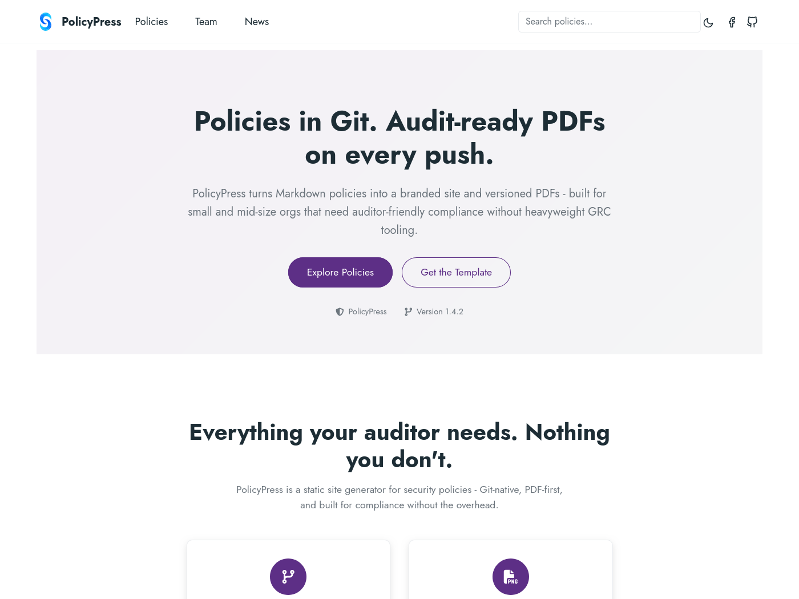
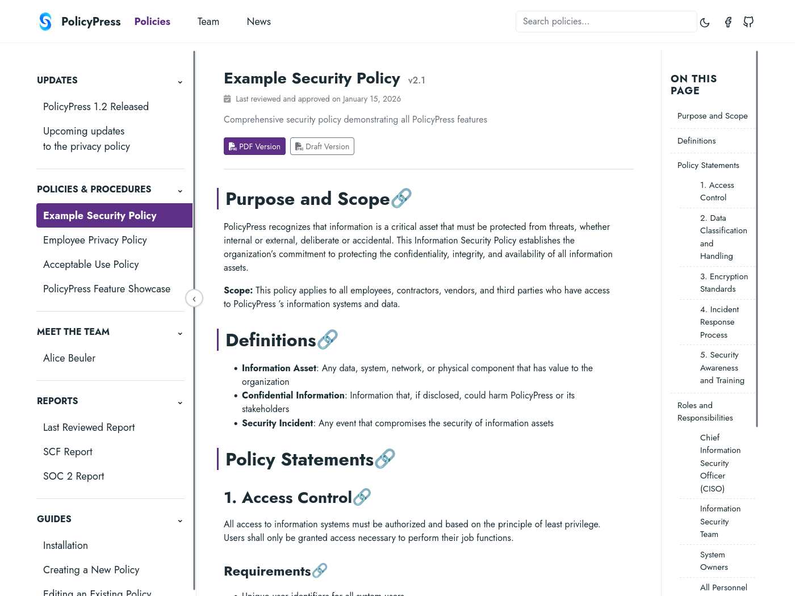
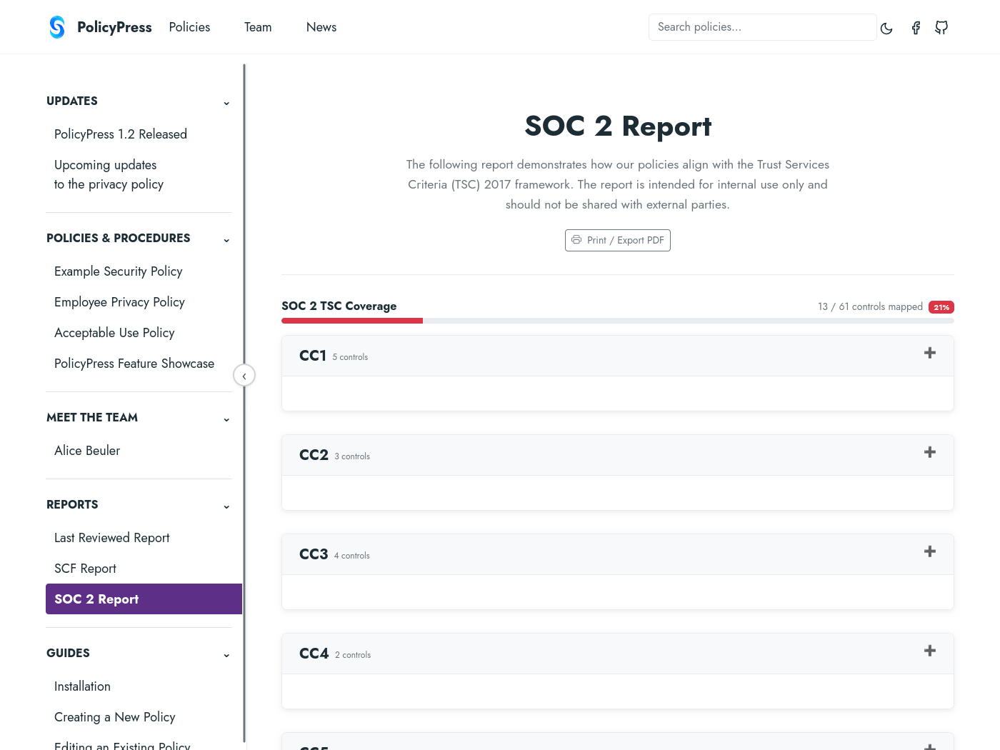

# PolicyPress

[](https://github.com/sc2in/policypress/actions/workflows/ci.yml)
[](https://github.com/sc2in/policypress/releases/latest)
[](LICENSING.md)

**▶ [Live demo](https://policypress.sc2.in)** · **[Documentation](https://policypress.sc2.in/guides/installation/)** · **[Sample PDF](https://policypress.sc2.in/pdfs/Example_Security_Policy__Redacted__-_v2.1.pdf)**

Compliance policy management for small and mid-size teams — write policies in Markdown, version them in Git, publish a branded static site, and generate audit-ready PDFs, all from a single GitHub Action.

PolicyPress is built on [Zola](https://www.getzola.org/) and [Typst](https://typst.app/). You host it yourself in your own Git repository — PolicyPress is the theme and toolchain, not the content, so your policies never leave your infrastructure. Organizations that run several instances — a nonprofit with multiple programs, or a small business with a few brands or entities — keep one shared toolchain and a separate, owned policy repository per entity.

> **Free to run for your own organization**, at any size — no subscription. A commercial license is required only to offer PolicyPress *to others* (an MSP running it for clients, a hosted/SaaS offering, or redistribution). See [Licensing](#license).

## See it in action

[](https://policypress.sc2.in)

| A policy page | Automatic compliance coverage |
| --- | --- |
| [](https://policypress.sc2.in/policies/example-security-policy/) | [](https://policypress.sc2.in/reports/soc2/) |

Browse the [live demo](https://policypress.sc2.in), or open a [sample redacted PDF](https://policypress.sc2.in/pdfs/Example_Security_Policy__Redacted__-_v2.1.pdf) straight from the pipeline.

## Who this is for

> *"I run a small business. My employees need an acceptable use policy, a data handling policy, maybe an employee handbook - right now it's a Word doc someone emailed around and nobody knows which version is current. I want something that looks professional, is always current, and doesn't require SharePoint."*

PolicyPress is for that person. If you are comfortable enough with GitHub to click a button and edit a text file, you can have a professional policy library with version-controlled PDFs in an afternoon. You do not need to know anything about web development, LaTeX, or compliance frameworks.

What you get:

- A policy website your employees can bookmark
- A PDF for every policy, named by title and version, ready to hand to an auditor or attach to a vendor questionnaire
- A full revision history:  who approved what, and when
- Draft watermarks for policies under review
- Redaction tags for internal notes that should not appear in distributed copies

## Why PolicyPress

Most teams manage policies in one of three ways, and each leaves a gap PolicyPress fills:

| Instead of… | The gap | With PolicyPress |
| --- | --- | --- |
| **Notion / Confluence / SharePoint** | No real version history, no audit-ready PDFs, not Git-native | Every change is a Git commit; each policy exports a versioned PDF |
| **Drata / Vanta** and other GRC SaaS | Heavyweight, cloud-only, subscription-priced; your data lives in their platform | Runs from your own repo with no subscription; your data never leaves your infrastructure |
| **Plain Zola / MkDocs** | A website, but no PDFs, no compliance-control mapping, no draft/redaction workflow | Site *and* PDFs from one source, with SCF/SOC 2 coverage reports and redaction built in |

Self-hosted, Git-native, and **free to run for your own organization** — any company size, no SaaS lock-in. (Optional support, and licenses for MSPs/resellers, are available; see [Licensing](#license).)

## How it works

1. Your policies live in a Git repository as Markdown files
2. On every push, the `sc2in/policypress` GitHub Action builds the policy site and generates PDFs
3. The site deploys to GitHub Pages; PDFs are uploaded as artifacts for download

## Quick start

**The fastest path:** use the [policypress-template](https://github.com/sc2in/policypress-template) repository. Click **Use this template → Create a new repository**, edit `config.toml` with your organization name and brand color, replace the logo, enable GitHub Pages, and push.

If you need Azure DevOps or a custom setup, see the [Installation guide](https://policypress.sc2.in/guides/installation/).

## Policy front matter

Every policy file starts with a YAML metadata block:

```yaml
---
title: "Acceptable Use Policy"
description: "Policy governing acceptable use of company resources"
weight: 10

taxonomies:
  SCF:
    - HRS-05
  TSC2017:
    - CC2.1

extra:
  owner: Jane Smith
  last_reviewed: "2025-01-15"
  major_revisions:
    - date: "2025-01-15"
      description: Annual review.
      revised_by: Jane Smith
      approved_by: John Doe
      version: "1.2"
---

Policy content goes here.


Internal notes - stripped from redacted PDFs.

```

## Action inputs

| Input | Default | Description |
| --- | --- | --- |
| `config_path` | `config.toml` | Path to the Zola config file |
| `output_dir` | `public` | Output directory for PDFs and reports |
| `draft_mode` | `false` | Stamp PDFs with a DRAFT watermark |
| `redact_mode` | `""` (inherit config) | Redact content inside redaction tags in the PDFs. `true`/`false` force it on/off; empty inherits the site's `[extra.policypress] redact` setting, keeping PDF links in lock-step with `config.toml` |
| `generate_draft_pdfs` | `false` | Also generate a second, DRAFT-watermarked set of PDFs (for sites with `show_draft_pdfs = true`) |
| `base_url` | `""` | Override `base_url` from `config.toml` (e.g. a preview URL); passed to `zola build --base-url` |
| `audit_bundle` | `false` | Also write a machine-readable audit bundle (`manifest.json` with per-PDF SHA-256 hashes, `revisions.json`, coverage export) under `<output_dir>/audit` |

## Action outputs

| Output | Description |
| --- | --- |
| `pdf_path` | Directory containing generated PDFs |
| `site_path` | Directory containing the built static site (`public/`) |
| `report_path` | Directory containing the generated report PDFs (same directory as `pdf_path`) |
| `audit_path` | Directory containing the audit bundle (populated when `audit_bundle: true`) |

## PDF output

PDFs are named `{Title}_-_v{version}.pdf`. With `redact_mode: true`, the name becomes `{Title}_(Redacted)_-_v{version}.pdf`. With `draft_mode: true`, it becomes `{Title}_(Draft)_-_v{version}.pdf`.

PDFs are generated with [Typst](https://typst.app/): markdown is rendered to Typst markup in-process ([zigmark](https://github.com/sc2in/zigmark)), mermaid diagrams become inline SVG via [pozeiden](https://github.com/sc2in/pozeiden), and the layout matches the classic [Eisvogel](https://github.com/Wandmalfarbe/pandoc-latex-template) look. The only external tool is the `typst` binary (bundled in the devshell and GitHub Action; on Windows install it with `winget install Typst.Typst` - without the Source Sans 3 font typst falls back to its embedded fonts, a cosmetic difference only).

Keep policies in **pure Markdown**. Raw or inline HTML renders on the website but the PDF pipeline silently drops it, so the two artifacts would diverge. The build flags raw HTML in any policy body as audit-critical - a warning by default, fatal with `--strict`. To show HTML as an example, put it in a fenced code block or inline code. Site-only pages (such as the guides on this site) may use HTML freely; only the policy directory is rendered to PDF.

## Compliance reports

The site includes optional compliance coverage views. To enable them, add your control data files and configure the paths:

```toml
[extra.policypress]
scf_controls     = "templates/opencontrols/standards/SCF.yml"
tsc2017_controls = "templates/opencontrols/standards/TSC-2017 (SOC2).yml"
scf_report_page  = "@/reports/scf.md"
soc2_report_page = "@/reports/soc2.md"
```

Control data files are customer-supplied - PolicyPress does not ship them. The format matches the [OpenControl](https://open-control.org/) standard.

## Local development

Requires [Nix](https://nixos.org/download/).

```sh
# Live preview with hot reload (recommended)
nix run github:sc2in/policypress#serve

# Generate PDFs only
nix run github:sc2in/policypress -- -c config.toml -o public

# Generate redacted PDFs
nix run github:sc2in/policypress -- -c config.toml -o public/redacted --redact

# Verbose output (shows typst invocations)
nix run github:sc2in/policypress -- -v -c config.toml -o public

# CI-friendly JSON log output
nix run github:sc2in/policypress -- --json -c config.toml -o public
```

### Building from source

```sh
git clone https://github.com/sc2in/policypress
cd policypress
nix develop
zig build
zig build test
```

## Dependencies

| Dependency | Purpose |
| --- | --- |
| [Zola](https://www.getzola.org/) | Static site generator |
| [Typst](https://typst.app/) | PDF compilation |
| [zigmark](https://github.com/sc2in/zigmark) | Markdown parsing + Typst rendering |
| [pozeiden](https://github.com/sc2in/pozeiden) | Mermaid diagrams to SVG |
| [tomlz](https://github.com/tsunaminoai/tomlz) | TOML config parsing |
| [clap](https://github.com/Hejsil/zig-clap) | CLI argument parsing |
| [mvzr](https://github.com/mnemnion/mvzr) | Regex for markdown transforms |
| [zig-datetime](https://github.com/frmdstryr/zig-datetime) | Date handling |

## Credits

PolicyPress is developed and maintained by [Star City Security Consulting, LLC (SC2)](https://sc2.in).

**Primary contributors:**

- [Ben Craton](https://github.com/TsunamiNoAi) - architecture, implementation, security design

**With assistance from:**

- [Perplexity.ai](https://www.perplexity.ai) - research assistance
- [Github Copilot](https://copilot.github.com/) - pair programming and code review
- [Claude](https://claude.ai) (Anthropic) - pair programming and code review

**Built on:**

- [Zola](https://www.getzola.org/) - static site generator
- [Typst](https://typst.app/) - PDF typesetting
- [Eisvogel](https://github.com/Wandmalfarbe/pandoc-latex-template) by Pascal Wagler - the PDF layout PolicyPress reproduces
- [Secure Controls Framework (SCF)](https://securecontrolsframework.com/) - control taxonomy
- [AICPA Trust Services Criteria (TSC)](https://www.aicpa-cima.com/resources/landing/2017-trust-services-criteria) - SOC 2 control framework

## License

PolicyPress is offered under multiple licenses — use whichever one fits (full details in **[LICENSING.md](LICENSING.md)**):

- **[PolyForm Noncommercial 1.0.0](LICENSE)** — free for personal projects, research, education, nonprofits, and government.
- **[PolyForm Internal Use 1.0.0](LICENSE-PolyForm-Internal-Use-1.0.0.md)** — free for **any company, at any size, managing its own policies**. Optional [support subscriptions](https://sc2.in) add SLAs and indemnification.
- **Commercial license** — required only to offer PolicyPress *to others* (MSPs/consultancies running it for clients, hosted/SaaS, embedding, or redistribution). Contact [sc2.in](https://sc2.in).

The source is public under all of them: read it, run it, modify it, and self-host it.

Copyright © 2026 Star City Security Consulting, LLC (SC2) - [sc2.in](https://sc2.in)
