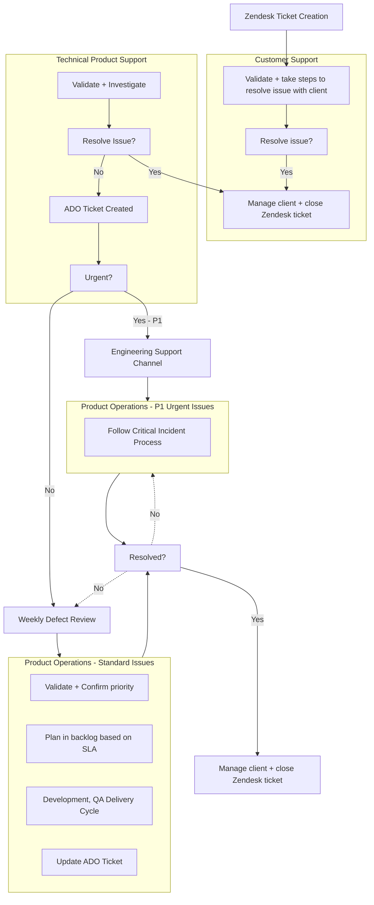
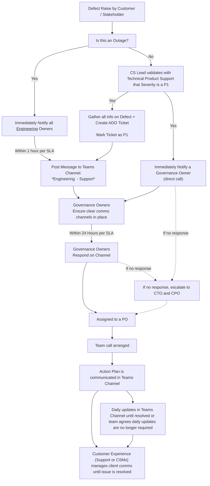

## Process Objectives

A new process is rolling out in June 2023 to better align Support and Product teams in managing live defects(bugs).​

The process provides:​

- Formalized workflow ​
- Alignment of roles and responsibilities​
- Clear communication channels​
- Guidelines for triaging and prioritizing live defects​
- ​Wider visibility on timeframes for managing defects​

### Key Principles for Managing Live Defects​

- Support teams work to resolve issues without engaging Product Operations​
- ​Prioritization of a defect is based on shared, defined set of parameters​
​- Defects are addressed based on the shared understanding of the priority parameters and expectations.​
- ​Product Owners are the key Product & Engineering points of contact for defects raised by the Support team in P&E teams. (It is no longer the Tech Leads) ​
- ​No Defect is attended to without a support ticket created.

## Roles & Responsibilities

*Note: Technical Leads are not listed here because the Product Owners manage their work. They can be consulted as required, but the Product Owners will plan the work into a sprint. TPS will typically speak to POs before engaging with the Technical Leads.*

### Customer Support

- ​Owns Zendesk ticket until resolved​
- Owns client messaging until resolved​
- Runs initial investigations to resolve​
- Captures steps to reproduce, screenshots + other required information

### Technical Product Support

- Validates the issue​
- Runs deeper investigation to try and resolve​
- Creates the ADO ticket​
- Sets initial Severity level​
- Sets initial Risk of Exposure Level​
- Sets initial Priority level​
- Captures further information if required by engineering​
- Escalates to Teams channel if a P1​
- Runs the Weekly defect meeting

### Product Owner

- Owns the ADO ticket (after created)​
- Triages the defects to validate the Priority​
- Manages the planning of defects into the backlog​
- Manages comms back to the TPS​
- Manages the SLA for the bugs

### Governance Owners

- Oversee the process to ensure teams following process​
- Provides escalation point for missed SLAs​
- Helps manage the P1 escalation process to ensure the right people are assigned to resolving the issue​
- Provides direction as required during defect review meetings

#### Governance/ Escalation Owners

### When, Why , & Who to Contact​

|You are on the…​ | Scenario​ |Who to contact​|
|---|---|---|
| Customer Support team​ | You have a Defect you cannot resolve with the client​ | Technical Product Support team​|
| Technical Product Support team ​ | You have a defect actively troubleshooting or, questions come up from customers/internal that cannot be answered​ | The correct Product Owner based on product area​|
| Technical Product Support team ​| You’re not sure which PO (team) to contact ​| Joe Ranson or Justin Noelle or Liz Drews​|
| Customer Success or Implementation Consultant team​ | You have a customer with a defect that is requesting updates​ | Customer Support team (via Zendesk case) or Technical Product Support team​|
| Any team​ | You have a reported P1 critical issue​ | Technical Product Support team ​|
| Technical Product Support team / Product Owner team​ | You have a reported P1 critical issue​ | Governance Owners (Joe Ranson, Liz Drews, Justin N, Forest E)​|

#### Product Owners by Team

 
|Product Owner​|Team​|Main Areas in the app covered​|
|---|---|---|

## The Defect Workflow

## Prioritization

### Setting *Internal* Priority

Use the Priority table below to define an Internal Priority  - Based on Severity of the issue and risk of exposure (i.e. how many users could this potentially impact based on the usage level of the impacted feature)​

We have moved away from % risk exposure as this cannot be quantified. The value of the risk of exposure accepts this is not fully quantifiable either. The Priority is set by TPS and adjusted by Product Owners or TPS due to changes in circumstances.

| Exposure Risk / Severity | 1 (All) | 2 (High) | 3 (Medium) | 4 (Low) |
|--------------:|:-------:|:----------:|:--------:|:------------:|
| **Critical**:​ System/Function is unusable | P1: Critical | P1: Critical | P1: Critical | P1: Critical / P2: High |
| **High**:​​ Users can no longer perform primary work functions | P1: Critical | P1: Critical / P2: High | P2: High | P2: High / P3: Medium |
| **Medium**:​​ Low level Work functions impaired / workaround available | P2: High | P3: Medium | P3: Medium | P4: Low |
| **Low**:​​ Inconvenient | P3: Medium | P4: Low | P4: Low | P4: Low |

- P1: Critical - Hotfix in current sprint
- P2: High - Plan next sprint
- P3: Medium - 3 months
- P4: Low - 6 months review

**When prioritizing, use the table to guide decisions, but take other considerations into account:**

- Size of client/s (ARR)​
- Effort to resolve​
- Security Risk Level​
- Perception to Business​
- Extreme (Rate of calls)​
- Premium paid for features

## Service Level Understandings (SLUs)

SLUs will be agreed upon for defects based on the priority level. They are used to:​

- Provide visibility to teams on when they can expect initial responses, updates, and resolutions​
- Focus on what is important and reduce noise​

|Priority Level​|Initial Response Timeframe​|Response Mechanism​|Resolution Timeframe​|Update Frequency​|
|---|---|---|---|---|
|P1: Critical​ (Outage)​|< 1 Hour​|Update on Teams Channel​|Hotfix in current sprint​|Hourly​|
|P1: Critical​|24 Hours​|Update on Teams Channel​|Hotfix in current sprint​|Daily​|
|P2: High​|1 Week​|ADO Update + weekly call​|Plan into current or next Sprint*​|Weekly​|
|P3: Medium​|1 Month​|ADO update + weekly call​|3 Months​|-​|
|P4: Low​|1 Month​|ADO update + weekly call​|6 month review​|-​|

P3/P4 Tickets will be reviewed every 6 months ​

- IF the defect created date > 9 months AND no new support tickets have been raised, THEN…​
  - EITHER close the Bug and silently close the Zendesk Ticket,
  - OR upgrade it and fix it within 3 months​

If a defect has not been resolved after 9 months and users are not affected, it’s unlikely that the issue is significant enough to warrant prioritization. We will remove it to keep a clean backlog OR choose to fix it in the next 3 months. We won’t keep long-standing defects in the backlog.

## Critical Incident Process

## Appendices

